# @explorer02/api-playground

A React component library for interactive GraphQL & REST API exploration.

[](https://www.npmjs.com/package/@explorer02/api-playground)
[](https://api-playground-git-main-explorer02s-projects.vercel.app/demo)

---

## Features

- **11 built-in template types** covering static data display, query/mutation execution, form-driven workflows, REST API testing, schema introspection, and more
- **Monaco Editor** integration with syntax highlighting for JSON, GraphQL, JavaScript, and TypeScript
- **Apollo Cache Viewer** for inspecting and editing the Apollo Client normalized cache
- **Form-driven queries and mutations** with validation, initial values, and configurable field layouts
- **REST API client** with support for GET, POST, PUT, DELETE, and PATCH methods
- **Schema introspection** via the SCHEMA_VIEWER template
- **Execution timing** displayed for query and mutation operations
- **Query history** for previously executed operations
- **Keyboard shortcuts** including Cmd/Ctrl+Enter to execute queries and mutations
- **Fully configurable via TypeScript** with exported types for every template config

---

## Installation

```bash
npm install @explorer02/api-playground
```

### Peer Dependencies

The following peer dependencies must be installed in your project:

- `react` (>=18.0.0)
- `react-dom` (>=18.0.0)
- `@apollo/client` (>=3.8.0)
- `graphql` (>=16.0.0)

### CSS Imports

> **Important:** You must import the stylesheet for the playground to render correctly. Without this import, components will appear unstyled.

```ts
import '@explorer02/api-playground/dist/index.css';
```

---

## Quick Start

```tsx
import { ApolloClient, InMemoryCache, ApolloProvider } from '@apollo/client';
import { APIPlayground, Template } from '@explorer02/api-playground';
import '@explorer02/api-playground/dist/index.css';

const client = new ApolloClient({
  uri: 'https://your-graphql-endpoint.com/graphql',
  cache: new InMemoryCache(),
});

const config = [
  {
    id: 'example',
    type: Template.STATIC_DATA,
    title: 'Example Data',
    data: { message: 'Hello, world!' },
  },
];

function App() {
  return (
    <ApolloProvider client={client}>
      <APIPlayground config={config} />
    </ApolloProvider>
  );
}
```

---

## Templates

### STATIC_DATA

Displays a static JSON object or string in a Monaco editor. Useful for showing configuration data, environment info, or any read-only content.

**Config type:**

```ts
type StaticDataConfig = {
  id: string;
  title: string;
  type: Template.STATIC_DATA;
  data: object | string;
  language?: Language; // default: JSON. Options: JSON, GRAPHQL, JAVASCRIPT, TYPESCRIPT
  readOnly?: boolean;
};
```

**Example:**

```ts
{
  id: 'current_user',
  type: Template.STATIC_DATA,
  title: 'Current User',
  data: {
    name: 'Ajay Bhardwaj',
    role: 'Developer',
    preferences: { theme: 'light', language: 'en' },
  },
}
```

You can also display a raw string with a specific language for syntax highlighting:

```ts
{
  id: 'schema_info',
  type: Template.STATIC_DATA,
  title: 'Schema Info',
  data: `type Character { id: ID! name: String! }`,
  language: Language.GRAPHQL,
  readOnly: true,
}
```

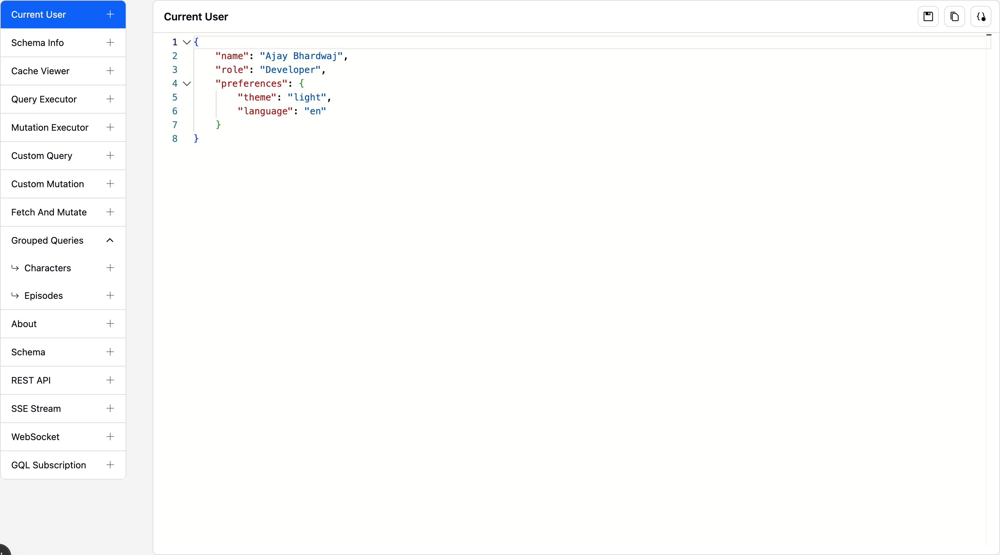

---

### CACHE_VIEWER

Inspects the Apollo Client normalized cache. Displays the full cache contents and allows editing.

**Config type:**

```ts
type CacheViewerConfig = {
  id: string;
  title: string;
  type: Template.CACHE_VIEWER;
  client: ApolloClient<NormalizedCacheObject>;
  readOnly?: boolean;
};
```

**Example:**

```ts
{
  id: 'apollo_cache',
  type: Template.CACHE_VIEWER,
  title: 'Cache Viewer',
  client: apolloClient,
}
```

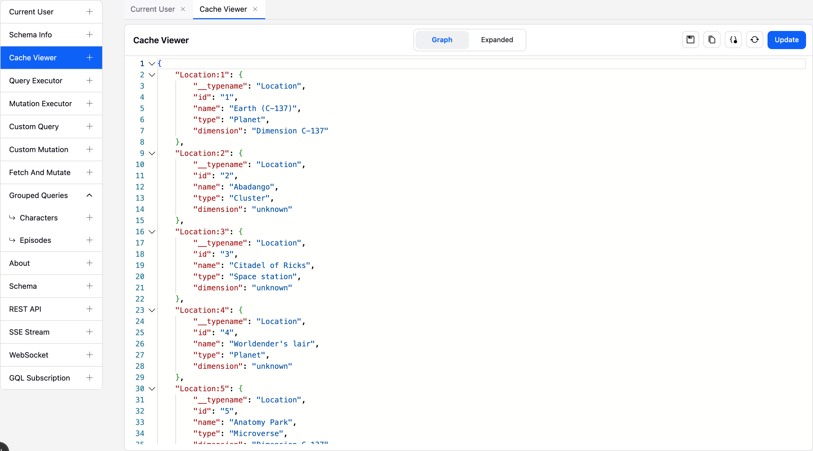

---

### QUERY_EXECUTOR

A free-form GraphQL query editor. Provides input panes for the query string and variables, and displays the response in a separate output pane.

**Config type:**

```ts
type QueryExecutorConfig = {
  id: string;
  title: string;
  type: Template.QUERY_EXECUTOR;
  client: ApolloClient<NormalizedCacheObject>;
  config?: {
    input?: { title?: string };
    variable?: { title?: string };
    output?: { title?: string; readOnly?: boolean };
  };
};
```

**Example:**

```ts
{
  id: 'query_executor',
  type: Template.QUERY_EXECUTOR,
  title: 'Query Executor',
  client: apolloClient,
  config: {
    input: { title: 'GraphQL Query' },
    variable: { title: 'Variables (JSON)' },
    output: { title: 'Response', readOnly: true },
  },
}
```

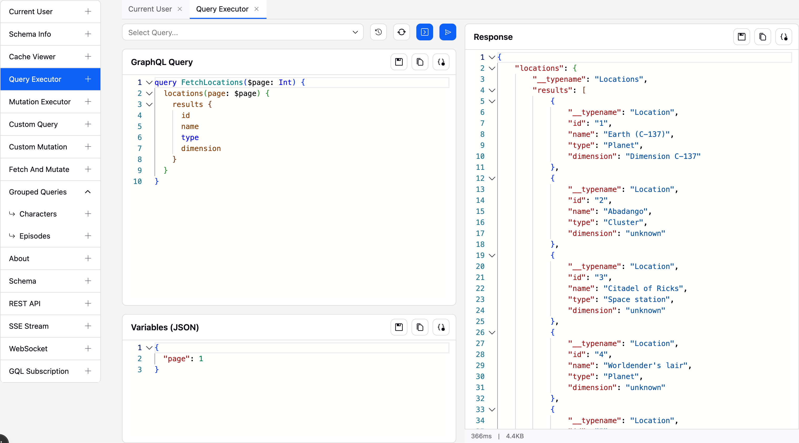

---

### MUTATION_EXECUTOR

Similar to QUERY_EXECUTOR but oriented toward mutations. Supports preset mutations that users can select from a dropdown.

**Config type:**

```ts
type MutationExecutorConfig = {
  id: string;
  title: string;
  type: Template.MUTATION_EXECUTOR;
  client: ApolloClient<NormalizedCacheObject>;
  config?: {
    input?: { title?: string };
    variable?: { title?: string };
    output?: { title?: string; readOnly?: boolean };
  };
  mutations?: { id: string; label: string; node: DocumentNode; variables: object }[];
};
```

**Example:**

```ts
{
  id: 'mutation_executor',
  type: Template.MUTATION_EXECUTOR,
  title: 'Mutation Executor',
  client: apolloClient,
  mutations: [
    {
      id: 'create_location',
      label: 'Create Location (page 1)',
      node: CREATE_LOCATION_MUTATION,
      variables: { page: 1 },
    },
  ],
}
```

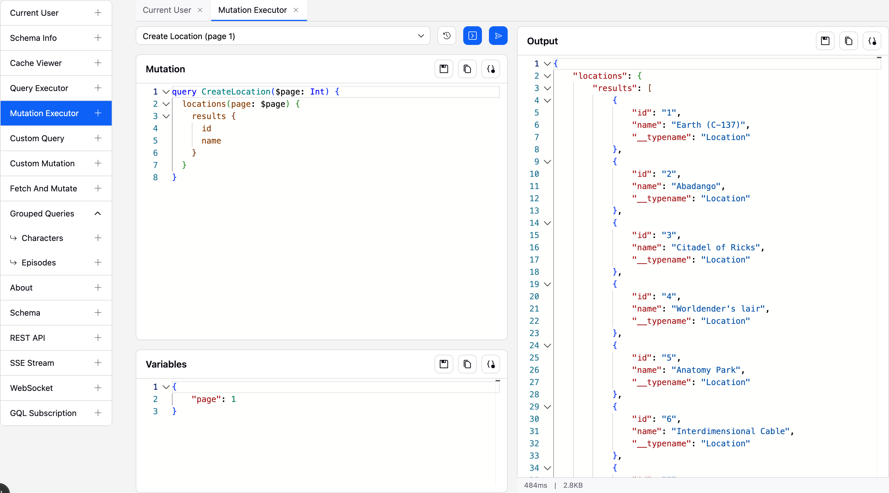

---

### CUSTOM_QUERY

Executes a predefined GraphQL query with a form-driven input. Users fill in form fields, and the component maps form values to query variables.

**Config type:**

```ts
type CustomQueryConfig = {
  id: string;
  title: string;
  type: Template.CUSTOM_QUERY;
  client: ApolloClient<NormalizedCacheObject>;
  query: DocumentNode;
  fieldConfigMap: FieldConfigMap;
  formLayout: FormLayout;
  getVariables: (formValues: FormValues) => object;
  validator?: (formValues: FormValues) => FormErrors;
  initialValues?: FormValues;
  outputConfig?: { readOnly?: boolean };
};
```

**Example:**

```ts
import { FieldConfigMapBuilder, FormFieldType } from '@explorer02/api-playground';

const fieldConfigMap = new FieldConfigMapBuilder()
  .addField({
    id: 'page',
    label: 'Page No.',
    type: FormFieldType.NUMBER,
    required: true,
    placeholder: 'Enter page (1-42)',
  })
  .build();

{
  id: 'custom_query',
  type: Template.CUSTOM_QUERY,
  title: 'Custom Query',
  client: apolloClient,
  query: FETCH_LOCATIONS,
  fieldConfigMap,
  formLayout: { fields: ['page'] },
  initialValues: { page: 1 },
  validator: (vals) => {
    const errors = {};
    const page = Number(vals.page);
    if (isNaN(page) || page < 1 || page > 42) errors.page = 'Page must be between 1 and 42';
    return errors;
  },
  getVariables: (obj) => ({ page: Number(obj.page) }),
  outputConfig: { readOnly: true },
}
```

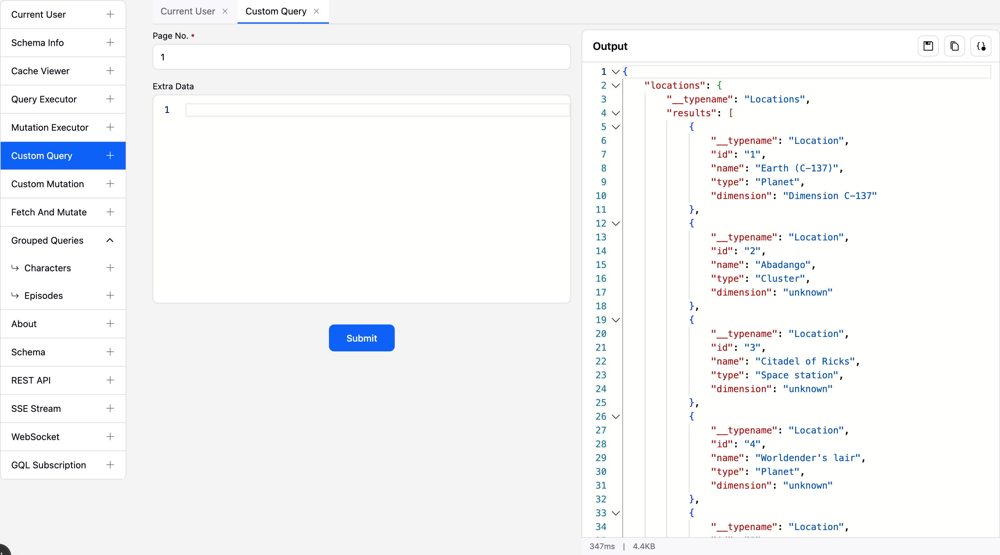

---

### CUSTOM_MUTATION

Same form-driven approach as CUSTOM_QUERY but for mutations.

**Config type:**

```ts
type CustomMutationConfig = {
  id: string;
  title: string;
  type: Template.CUSTOM_MUTATION;
  client: ApolloClient<NormalizedCacheObject>;
  mutation: DocumentNode;
  fieldConfigMap: FieldConfigMap;
  formLayout: FormLayout;
  getVariables: (formValues: FormValues) => object;
  validator?: (formValues: FormValues) => FormErrors;
  initialValues?: FormValues;
  outputConfig?: { readOnly?: boolean };
};
```

**Example:**

```ts
{
  id: 'custom_mutation',
  type: Template.CUSTOM_MUTATION,
  title: 'Custom Mutation',
  client: apolloClient,
  mutation: CREATE_LOCATION,
  fieldConfigMap: pageFieldConfig,
  formLayout: { fields: ['page'] },
  initialValues: { page: 4 },
  getVariables: (obj) => ({ page: Number(obj.page) }),
}
```

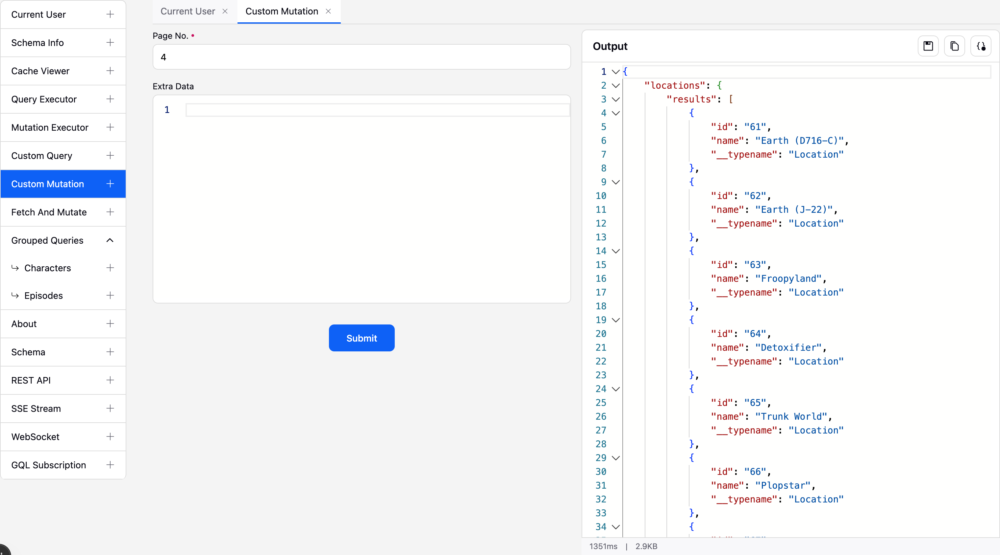

---

### FETCH_AND_MUTATE

A two-step workflow: first fetch data with a form-driven query, then execute a mutation using the fetched data and form values.

**Config type:**

```ts
type FetchAndMutateConfig = {
  id: string;
  title: string;
  type: Template.FETCH_AND_MUTATE;
  client: ApolloClient<NormalizedCacheObject>;
  fetchConfig: {
    formLayout: FormLayout;
    fieldConfigMap: FieldConfigMap;
    query: DocumentNode;
    getVariables: (formValues: FormValues) => object;
    validator?: (formValues: FormValues) => FormErrors;
    initialValues?: FormValues;
    output?: { title?: string };
    cta?: { label: string };
  };
  mutateConfig: {
    mutation: DocumentNode;
    getVariables: (formValues: FormValues, queryResponse: object) => object;
    validator?: (formValues: FormValues) => FormErrors;
    output?: { title?: string };
  };
};
```

**Example:**

```ts
{
  id: 'fetch_and_mutate',
  type: Template.FETCH_AND_MUTATE,
  title: 'Fetch And Mutate',
  client: apolloClient,
  fetchConfig: {
    fieldConfigMap: pageFieldConfig,
    formLayout: { fields: ['page'] },
    initialValues: { page: 1 },
    getVariables: (obj) => ({ page: Number(obj.page) }),
    query: FETCH_LOCATIONS,
    cta: { label: 'Fetch Locations' },
    output: { title: 'Fetch Result' },
  },
  mutateConfig: {
    mutation: UPDATE_LOCATION,
    getVariables: (formValues, queryResponse) => ({
      page: Number(formValues.page),
    }),
    output: { title: 'Mutation Result' },
  },
}
```

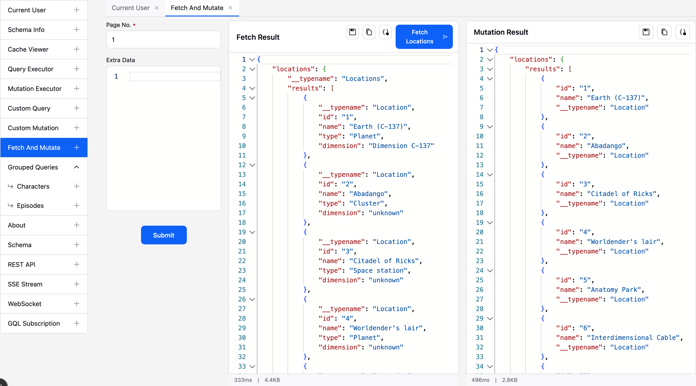

---

### NESTED_TEMPLATE

Groups multiple templates under a single sidebar entry with sub-navigation. Accepts any array of non-nested template configs.

**Config type:**

```ts
type NestedTemplateConfig = {
  id: string;
  title: string;
  type: Template.NESTED_TEMPLATE;
  templates: PlainTemplates[]; // any template type except NESTED_TEMPLATE
};
```

**Example:**

```ts
{
  id: 'nested_executors',
  type: Template.NESTED_TEMPLATE,
  title: 'Grouped Queries',
  templates: [
    {
      id: 'characters',
      type: Template.CUSTOM_QUERY,
      title: 'Characters',
      client: apolloClient,
      query: FETCH_CHARACTERS,
      fieldConfigMap: characterFieldConfig,
      formLayout: { fields: ['page'] },
      initialValues: { page: 1 },
      getVariables: (obj) => ({ page: Number(obj.page) }),
    },
    {
      id: 'episodes',
      type: Template.CUSTOM_QUERY,
      title: 'Episodes',
      client: apolloClient,
      query: FETCH_EPISODES,
      fieldConfigMap: episodeFieldConfig,
      formLayout: { fields: ['page'] },
      initialValues: { page: 1 },
      getVariables: (obj) => ({ page: Number(obj.page) }),
    },
  ],
}
```

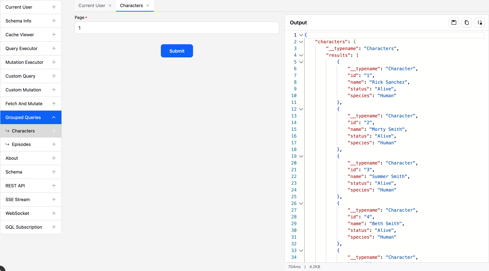

---

### CUSTOM

Renders any React component you provide. Use this when none of the built-in templates fit your needs.

**Config type:**

```ts
type CustomTemplateConfig = {
  id: string;
  title: string;
  type: Template.CUSTOM;
  Component: ComponentType;
};
```

**Example:**

```tsx
const AboutPanel = () => (
  <div style={{ padding: '24px' }}>
    <h2>About</h2>
    <p>Custom content goes here.</p>
  </div>
);

{
  id: 'about',
  type: Template.CUSTOM,
  title: 'About',
  Component: AboutPanel,
}
```

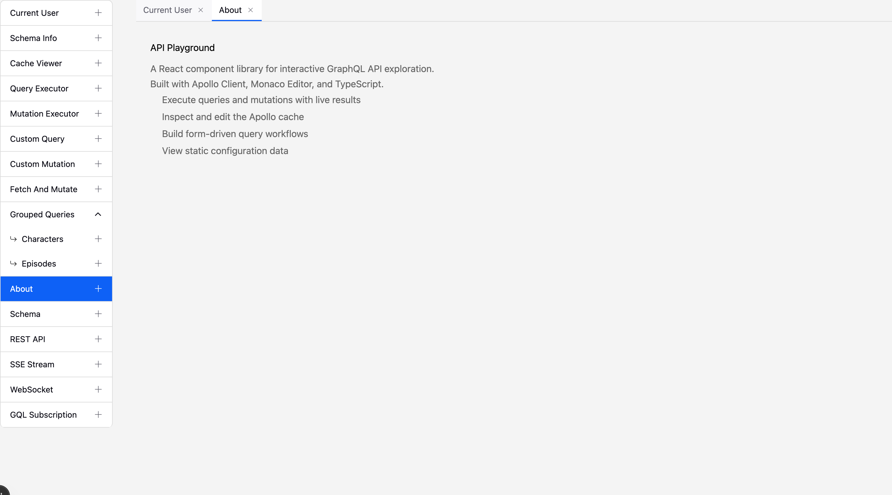

---

### SCHEMA_VIEWER

Runs an introspection query against the GraphQL endpoint and displays the full schema.

**Config type:**

```ts
type SchemaViewerConfig = {
  id: string;
  title: string;
  type: Template.SCHEMA_VIEWER;
  client: ApolloClient<NormalizedCacheObject>;
};
```

**Example:**

```ts
{
  id: 'schema_viewer',
  type: Template.SCHEMA_VIEWER,
  title: 'Schema',
  client: apolloClient,
}
```

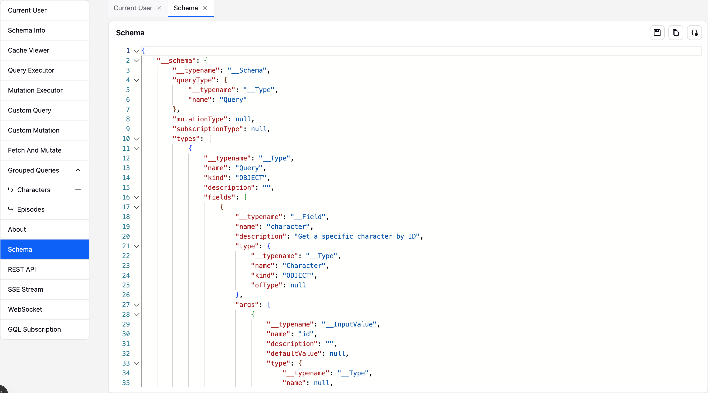

---

### REST_API

A REST API client for testing HTTP endpoints. Supports configurable default URL, method, headers, and body.

**Config type:**

```ts
type RestApiConfig = {
  id: string;
  title: string;
  type: Template.REST_API;
  defaultUrl?: string;
  defaultMethod?: 'GET' | 'POST' | 'PUT' | 'DELETE' | 'PATCH';
  defaultHeaders?: Record<string, string>;
  defaultBody?: string;
};
```

**Example:**

```ts
{
  id: 'rest_api',
  type: Template.REST_API,
  title: 'REST API',
  defaultUrl: 'https://jsonplaceholder.typicode.com/posts/1',
  defaultMethod: 'GET',
  defaultHeaders: { 'Content-Type': 'application/json' },
}
```

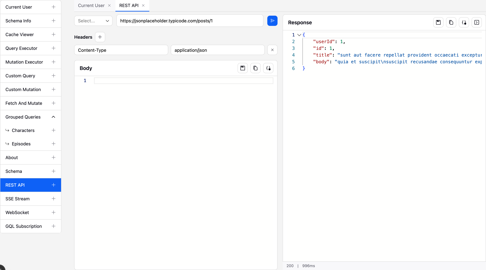

---

## API Reference

### Exported Component

| Export          | Description                                   |
| --------------- | --------------------------------------------- |
| `APIPlayground` | Main component. Accepts `APIPlaygroundProps`. |

### Enums

| Enum            | Values                                                                                                                                                                                |
| --------------- | ------------------------------------------------------------------------------------------------------------------------------------------------------------------------------------- |
| `Template`      | `STATIC_DATA`, `CACHE_VIEWER`, `QUERY_EXECUTOR`, `MUTATION_EXECUTOR`, `CUSTOM_QUERY`, `CUSTOM_MUTATION`, `FETCH_AND_MUTATE`, `NESTED_TEMPLATE`, `CUSTOM`, `SCHEMA_VIEWER`, `REST_API` |
| `Language`      | `JSON`, `GRAPHQL`, `JAVASCRIPT`, `TYPESCRIPT`                                                                                                                                         |
| `FormFieldType` | `TEXT`, `NUMBER`, `JSON`                                                                                                                                                              |

### Exported Types

| Type                     | Description                             |
| ------------------------ | --------------------------------------- |
| `APIPlaygroundProps`     | Props for the `APIPlayground` component |
| `TemplateConfig`         | Union of all template config types      |
| `StaticDataConfig`       | Config for `STATIC_DATA` template       |
| `CacheViewerConfig`      | Config for `CACHE_VIEWER` template      |
| `QueryExecutorConfig`    | Config for `QUERY_EXECUTOR` template    |
| `MutationExecutorConfig` | Config for `MUTATION_EXECUTOR` template |
| `CustomQueryConfig`      | Config for `CUSTOM_QUERY` template      |
| `CustomMutationConfig`   | Config for `CUSTOM_MUTATION` template   |
| `FetchAndMutateConfig`   | Config for `FETCH_AND_MUTATE` template  |
| `NestedTemplateConfig`   | Config for `NESTED_TEMPLATE` template   |
| `CustomTemplateConfig`   | Config for `CUSTOM` template            |
| `SchemaViewerConfig`     | Config for `SCHEMA_VIEWER` template     |
| `RestApiConfig`          | Config for `REST_API` template          |

### Utilities

| Export                  | Description                                                                                                |
| ----------------------- | ---------------------------------------------------------------------------------------------------------- |
| `FieldConfigMapBuilder` | Builder class for constructing `FieldConfigMap` objects. Chain `.addField(config)` calls, then `.build()`. |

**FieldConfigMapBuilder usage:**

```ts
import { FieldConfigMapBuilder, FormFieldType } from '@explorer02/api-playground';

const fieldConfigMap = new FieldConfigMapBuilder()
  .addField({
    id: 'name',
    label: 'Name',
    type: FormFieldType.TEXT,
    required: true,
    placeholder: 'Enter name',
  })
  .addField({
    id: 'count',
    label: 'Count',
    type: FormFieldType.NUMBER,
  })
  .addField({
    id: 'metadata',
    label: 'Metadata',
    type: FormFieldType.JSON,
  })
  .build();
```

---

## Keyboard Shortcuts

| Shortcut         | Action                                       |
| ---------------- | -------------------------------------------- |
| `Cmd/Ctrl+Enter` | Execute the current query or mutation        |
| `Cmd+D`          | Select next occurrence (Monaco built-in)     |
| `Cmd+F`          | Find in editor (Monaco built-in)             |
| `Cmd+H`          | Find and replace in editor (Monaco built-in) |

---

## Build

```bash
yarn build
```

The build process uses **tsup** for JavaScript/TypeScript bundling and **sass** for CSS compilation. Output is written to the `dist/` directory with both ESM (`.mjs`) and CJS (`.cjs`) formats. Type declarations are emitted to `types/`.

---

## License

ISC Licensed. Copyright (c) [@explorer02](https://github.com/explorer02).
